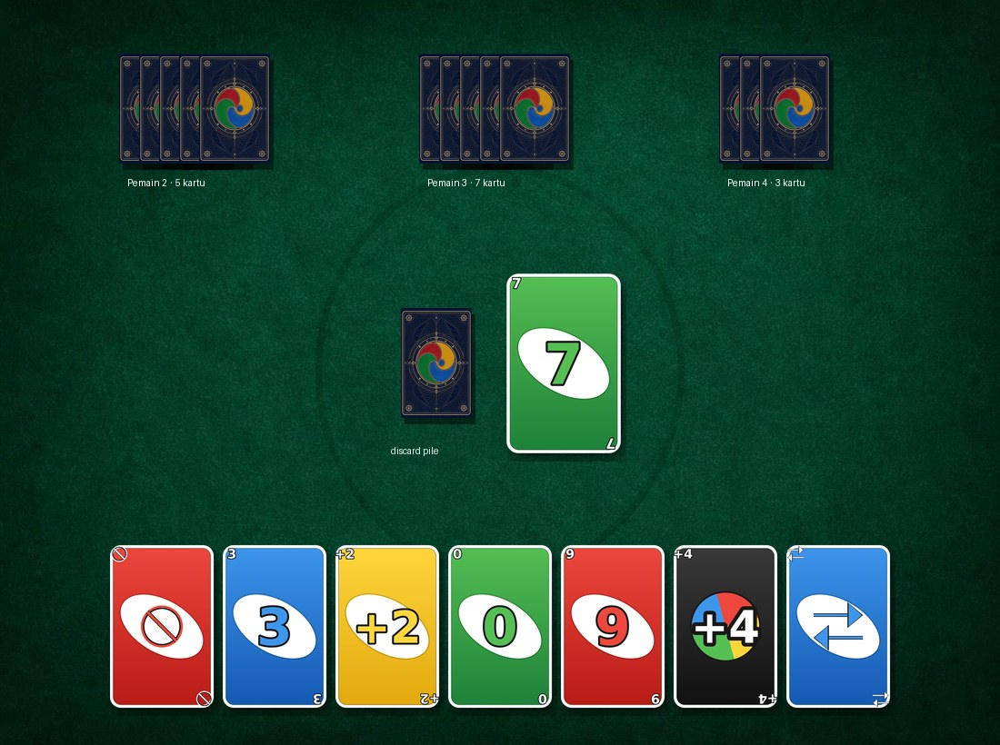

# Uno Online

Uno multiplayer sederhana: Cloudflare Worker (WebSocket) sebagai server otoritatif + klien vanilla JS.

## Struktur

```
client/                    # file statis yang disajikan Worker (assets)
  index.html
  app.js
  style.css
  assets/cards/            # 55 gambar kartu (400x620)
  assets/table/felt.jpg    # latar meja
server/index.js            # Worker: WebSocket + seluruh validasi permainan
shared/uno-logic.js        # logika inti Uno (hanya dijalankan di server)
tools/generate_cards.py    # generator aset kartu (PNG)
tests/                     # tes logika + tes E2E server
wrangler.toml
```

## Aset kartu




54 muka kartu + 2 punggung kartu, semua 400x620 px:

| Pola nama | Jumlah | Contoh |
|---|---|---|
| `{WARNA}_{0-9}.png` | 40 | `RED_5.png` |
| `{WARNA}_{SKIP\|REVERSE\|DRAW_TWO}.png` | 12 | `BLUE_REVERSE.png` |
| `WILD.png`, `WILD_DRAW_FOUR.png` | 2 | — |
| `BACK.png`, `BACK_ornate.jpg` | 2 | punggung kartu |

Warna: `RED`, `YELLOW`, `GREEN`, `BLUE`.

Kartu digambar secara **vektor/deterministik** (bukan AI) supaya angka dan simbolnya
konsisten di semua kartu dan tajam di ukuran berapa pun. Regenerate kapan saja:

```bash
npm run cards          # = python3 tools/generate_cards.py
```

Butuh `Pillow` (`pip install Pillow`). Skrip ini menulis ulang `BACK.png` tetapi
**tidak** menyentuh `BACK_ornate.jpg`, jadi varian punggung kartu tetap aman.

Ganti punggung kartu di `client/index.html`:

```html

<!-- ganti ke assets/cards/BACK.png untuk versi flat -->
```

## Menjalankan

```bash
npm install
npm run dev      # http://localhost:8787
npm run deploy   # deploy ke Cloudflare
```

Buka dua jendela browser di `http://localhost:8787`:
1. Klik **Buat Room Baru** → salin kode room.
2. Di jendela kedua, masukkan kode → **Gabung Room**.
3. Salah satu pemain menekan **Mulai Game** (butuh minimal 2 pemain).

## Tes

```bash
npm test
```

- `tests/sim.mjs` — menguji `shared/uno-logic.js`: dek 108 kartu, pembagian 7 kartu,
  validasi kartu, anti-cheat (kartu harus ada di tangan), efek SKIP/REVERSE/DRAW_TWO/WILD_DRAW_FOUR,
  reshuffle saat dek habis, dan 30 simulasi game sampai ada pemenang.
- `tests/server-e2e.mjs` — menjalankan `server/index.js` di Node dengan mock WebSocket:
  buat/gabung room, mulai game, giliran, anti-impersonasi, game over, join saat game berjalan,
  keluar saat game berjalan, dan pembersihan room.

## Protokol pesan (klien → server)

| Tipe | Payload | Keterangan |
|---|---|---|
| `CREATE_ROOM` | `playerId` | Membuat room baru |
| `JOIN_ROOM` | `roomCode`, `playerId` | Masuk ke room (ditolak bila game sudah berjalan) |
| `LEAVE_ROOM` | – | Keluar dari room |
| `START_GAME` | – | Mulai game (min. 2 pemain, hanya bisa saat game belum jalan) |
| `PLAY_CARD` | `card:{color,type}`, `chosenColor` | Main kartu; `chosenColor` wajib untuk Wild |
| `DRAW_CARD` | – | Ambil satu kartu lalu akhiri giliran |

Identitas pemain diambil dari koneksi WebSocket di sisi server, **bukan** dari `playerId` di setiap pesan.

## Protokol pesan (server → klien)

`ROOM_CREATED`, `ROOM_JOINED`, `PLAYER_JOINED`, `PLAYER_LEFT`,
`GAME_STARTED`, `GAME_STATE_UPDATE`, `GAME_OVER`, `GAME_ABORTED`, `ERROR`.

`GAME_STATE_UPDATE` hanya memuat tangan milik penerima; tangan pemain lain
dikirim sebagai `{ id, count, isYou }`.

## Catatan arsitektur

State room disimpan di `Map` tingkat modul. Ini cukup untuk `wrangler dev` dan
traffic ringan pada satu isolate, tetapi **tidak dijamin persisten**: isolate
Cloudflare bisa didaur ulang, dan beberapa isolate tidak saling berbagi `Map`.
Untuk produksi serius, pindahkan state room ke
[Durable Objects](https://developers.cloudflare.com/durable-objects/) satu object per room.
