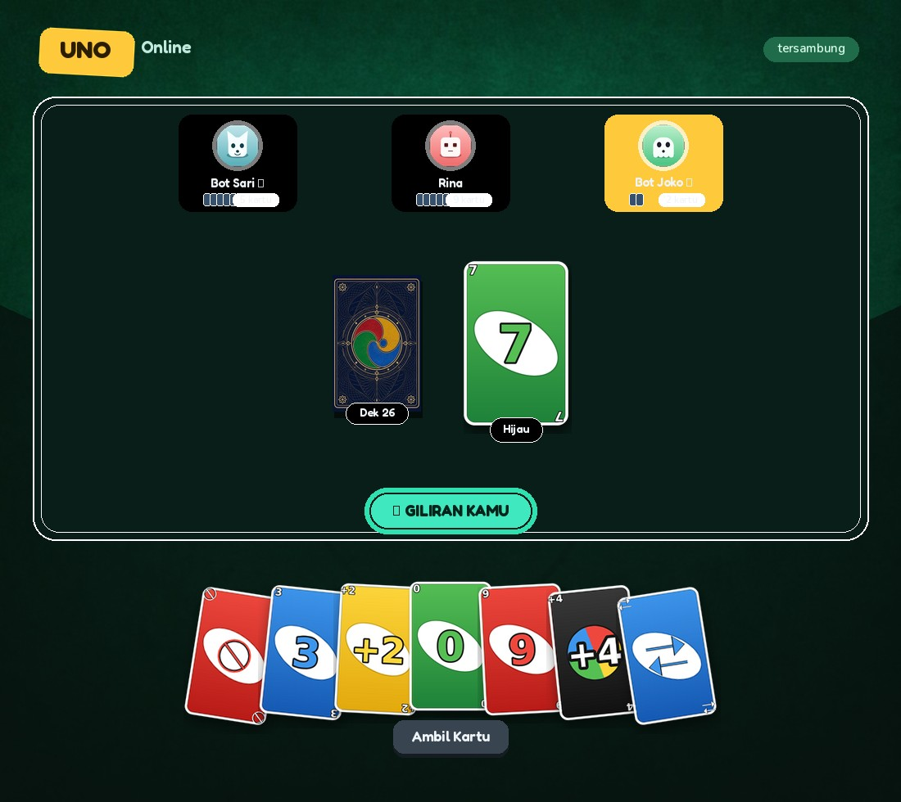
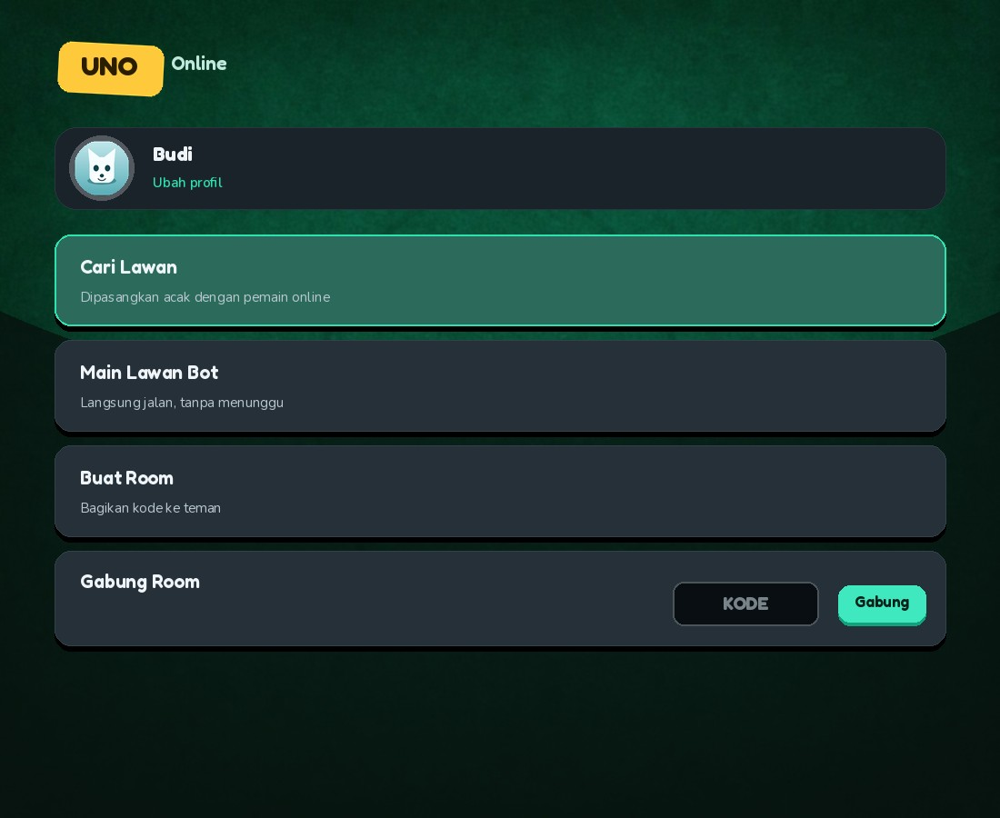
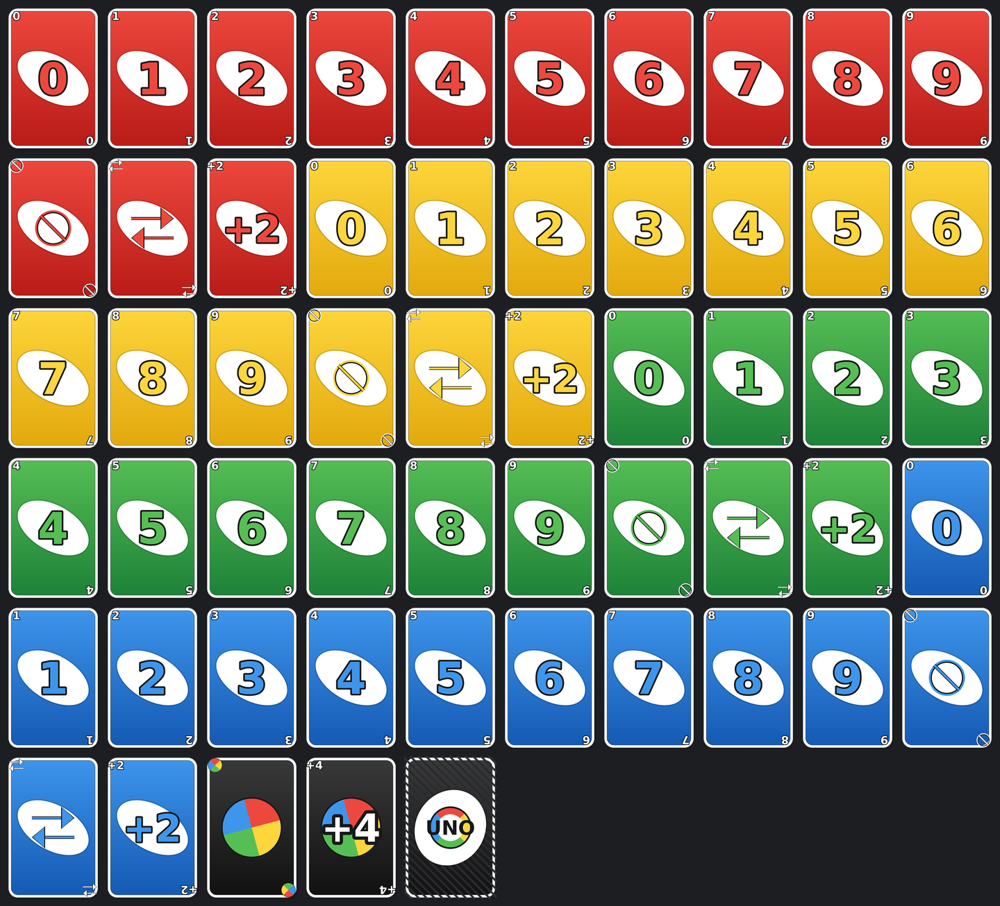
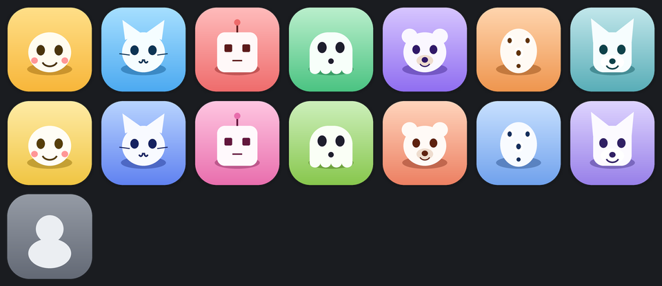

# Uno Online

**Game kartu Uno multiplayer di browser. Main langsung di sini:**

### ▶ https://uno-game-server-ins.officialrealmuoriginal.workers.dev/

Tidak perlu daftar. Isi nama, pilih avatar, lalu **Main Lawan Bot** untuk langsung
jalan — atau **Cari Lawan** untuk dipasangkan dengan pemain lain secara acak.

Fitur: room privat dengan kode 5 karakter, obrolan, avatar upload sendiri,
lawan bot, aturan rumahan opsional (keluar beberapa kartu sekaligus + tumpuk +2/+4).

Server = Cloudflare Worker (WebSocket) yang jadi satu-satunya penentu sah/tidaknya aksi.





## Fitur

- **Profil pemain** — nama (maks 16 karakter) + 14 avatar default, **atau upload foto
  sendiri** ke CDN INS. Disimpan di `localStorage`, jadi tidak perlu daftar akun dan
  tetap ada setelah refresh.
- **Cari Lawan** — matchmaking lawan acak. Kalau tidak ada pemain lain dalam ~7 detik,
  lawan diisi bot supaya tetap bisa langsung main.
- **Main Lawan Bot** — room instan berisi kamu + 1 bot.
- **Buat Room** — kode 5 karakter untuk dibagikan ke teman, plus tombol tambah/hapus
  bot (maks 3) sebelum mulai.
- **Hak host** — hanya pembuat room yang bisa menambah bot, menghapus bot, dan
  memulai game. Host otomatis dialihkan kalau pembuatnya keluar.
- **Bot** — memilih kartu berwarna sama lebih dulu, menyimpan Wild selama masih ada
  kartu normal, memakai kartu serang saat lawan hampir habis, dan memilih warna
  terbanyak di tangannya. Ada jeda berpikir 0,7–1,4 detik supaya terasa natural.
- **Aturan rumahan (opsional, ditentukan pembuat room)** — kalau dinyalakan:
  kartu dengan **angka atau simbol sama** boleh keluar sekaligus (RED 5 + BLUE 5,
  SKIP + SKIP), dan **+2/+4 bisa ditumpuk** untuk memindahkan hukuman ke pemain
  berikutnya sampai ada yang menyerah dan mengambil semuanya. Default **mati**,
  jadi perilaku bawaannya tetap seperti sekarang.
- **Obrolan room** — chat teks antar pemain di lobby maupun saat bermain. Teks
  dibersihkan dari karakter kontrol dan dibatasi 200 karakter di server.
- **Anti-curang** — identitas pemain diambil dari koneksi WebSocket (bukan dari isi
  pesan), tangan lawan hanya dikirim sebagai jumlah kartu, dan seluruh aturan
  divalidasi ulang di server.
- **State konsisten di semua isolate** — seluruh room dipegang oleh satu
  **Durable Object**, sehingga kode room selalu bisa dipakai.

## Struktur

```
client/                    # file statis yang disajikan Worker (assets)
  index.html
  app.js
  style.css
  assets/cards/            # 54 muka + 2 punggung kartu (400x620)
  assets/avatars/          # 14 avatar + fallback (256x256)
  assets/table/felt.jpg    # latar meja
server/index.js            # Worker + Durable Object: lobby, matchmaking, bot, chat, validasi
shared/uno-logic.js        # aturan inti Uno
shared/uno-bot.js          # kecerdasan bot
tools/generate_cards.py    # generator aset kartu
tools/generate_avatars.py  # generator aset avatar
tests/                     # tes logika, bot, dan E2E server
wrangler.toml
```

## Menjalankan

```bash
npm install
npm run dev      # http://localhost:8787
npm run deploy   # deploy ke Cloudflare
```

Cara paling cepat mencoba: buka `http://localhost:8787`, isi nama + pilih avatar,
lalu klik **Main Lawan Bot**. Untuk mencoba matchmaking sungguhan, buka dua jendela
browser dan klik **Cari Lawan** di keduanya.

## Tes

```bash
npm test
```

| Berkas | Cakupan |
|---|---|
| `tests/sim.mjs` | dek 108 kartu, aturan main, anti-cheat, efek kartu khusus, reshuffle, 30 game sampai selesai |
| `tests/bot.mjs` | identitas bot, strategi (kartu normal sebelum Wild, warna mayoritas), 40 game bot penuh |
| `tests/house-rules.mjs` | aturan rumahan: multi-kartu, efek aksi berlapis (2x SKIP, 2x +2), rantai tumpuk +2/+4, bot paham menumpuk, 45 simulasi penuh |
| `tests/server-e2e.mjs` | profil, avatar custom, lobby, hak host, bot jalan sendiri, matchmaking, fallback bot, keluar saat game |
| `tests/cdn-upload.mjs` | **tidak ikut `npm test`** — upload sungguhan ke CDN INS. Jalankan `npm run test:cdn` |
| `tests/production-check.mjs` | **tidak ikut `npm test`** — uji Worker yang sudah ter-deploy: halaman, aset, gabung room 8x, matchmaking, chat. Jalankan `npm run test:prod` |

## Avatar upload — integrasi CDN INS

Pemain bisa memilih salah satu dari **14 avatar bawaan**, atau meng-upload fotonya
sendiri. Foto dipotong tengah dan diperkecil ke **256x256 JPEG** di browser dulu
(hemat bandwidth), lalu dikirim langsung ke CDN — tidak lewat Worker.

### Kontrak CDN (sudah diverifikasi)

```
POST https://cdnins.insjay.biz.id/upload-send
  header : x-user-id: <id pemilik file>
           x-filename: <nama file>
  body   : multipart/form-data, field "file"

respons 200:
{
  "success": true,
  "url"            : "https://cloudins-cdn.insjay.biz.id/media/<hash>",
  "public_url"     : "https://cloudins-cdn.insjay.biz.id/media/<hash>",
  "fix_url"        : "https://cloudins-cdn.insjay.biz.id/<user>/media/<nama>",
  "user_media_url" : "https://cloudins-cdn.insjay.biz.id/<user>/media/<nama>",
  "filename"       : "..."
}
```

Host media berbeda dari host API: API di `cdnins.insjay.biz.id`, file publik di
`cloudins-cdn.insjay.biz.id`. Keduanya sudah masuk allow-list di server.

Yang dipakai sebagai `avatarUrl` adalah `public_url` karena URL-nya unik per upload —
`fix_url` memakai nama file yang sama, sedangkan CDN mengirim
`cache-control: public, max-age=31536000`, jadi re-upload bisa kena cache lama.

### Di mana konfigurasinya

| Berkas | Konstanta | Isi |
|---|---|---|
| `client/app.js` | `CDN` | URL upload, host yang diizinkan, batas ukuran, ukuran output |
| `server/index.js` | `AVATAR_URL_HOSTS` | allow-list host yang boleh dipakai sebagai `avatarUrl` |

### Catatan keamanan

- **Wajib HTTPS.** Halaman game berjalan di HTTPS, jadi permintaan ke `http://`
  akan diblokir browser sebagai mixed content.
- **`avatarUrl` divalidasi ketat di server.** Hanya `https:` + host di allow-list
  yang diterima; host asing, skema `javascript:`, dan domain mirip
  (`...insjay.biz.id.evil.com`) semuanya ditolak dan jatuh ke avatar bawaan.
- **CDN-nya tidak punya autentikasi.** `x-user-id` hanya nama, jadi siapa pun yang
  tahu endpoint bisa menulis ke sana. Karena itu tiap browser memakai ID acak
  16 hex (`uno-<16 hex>`) yang berfungsi seperti kunci, bukan nama pemain.
  Kalau CDN ini dipakai untuk hal serius, sebaiknya tambahkan token di sisi CDN.
- Kalau upload gagal (CDN mati/offline), pemain **tetap bisa main** memakai avatar
  bawaan — tidak ada alur permainan yang bergantung pada CDN.

### Kalau CDN berubah

Ubah `CDN.uploadUrl` di `client/app.js` dan `AVATAR_URL_HOSTS` di `server/index.js`,
lalu jalankan:

```bash
npm run test:cdn
```

## Protokol pesan

### Klien → server

| Tipe | Payload | Keterangan |
|---|---|---|
| `CREATE_ROOM` | `playerId`, `profile` | Buat room privat, pengirim jadi host |
| `JOIN_ROOM` | `roomCode`, `playerId`, `profile` | Gabung room (ditolak bila game berjalan) |
| `FIND_MATCH` | `playerId`, `profile` | Masuk antrean matchmaking |
| `CANCEL_MATCH` | – | Keluar dari antrean |
| `LEAVE_ROOM` | – | Keluar dari room |
| `ADD_BOT` / `REMOVE_BOT` | `botId` | Kelola bot (khusus host, hanya sebelum game) |
| `START_GAME` | – | Mulai game (khusus host, min. 2 pemain) |
| `SET_RULES` | `multiPlay`, `stacking` | Nyalakan/matikan aturan rumahan (khusus host, hanya sebelum game) |
| `PLAY_CARD` | `cards:[{color,type}]` (atau `card`), `chosenColor` | `cards` boleh >1 kalau aturan rumahan nyala. `chosenColor` wajib untuk Wild |
| `DRAW_CARD` | – | Ambil satu kartu lalu akhiri giliran |

`profile` = `{ name: string (1–16), avatar: 'a01'…'a14', avatarUrl?: string }` —
`avatarUrl` opsional, hanya diterima bila host-nya ada di allow-list CDN.

### Server → klien

`ROOM_CREATED`, `ROOM_JOINED`, `ROOM_UPDATE`, `PLAYER_LEFT`, `MATCH_SEARCHING`,
`MATCH_FOUND`, `MATCH_BOT_FILLED`, `MATCH_CANCELLED`, `GAME_STARTED`,
`GAME_STATE_UPDATE`, `GAME_OVER`, `GAME_ABORTED`, `ERROR`.

`GAME_STATE_UPDATE.gameState.players` = `[{ id, name, avatar, isBot, count, isYou }]` —
hanya tangan milik penerima yang dikirim penuh.

## Aset

Semua kartu dan avatar digambar **deterministik** (bukan AI) supaya angka, simbol, dan
gayanya konsisten serta tajam di ukuran apa pun. Regenerate kapan saja:

```bash
npm run cards      # 54 muka + 2 punggung kartu
npm run avatars    # 14 avatar + fallback
```

Butuh `Pillow` (`pip install Pillow`).




Punggung kartu default adalah `BACK_ornate.jpg` (ilustrasi ornamen). Ganti ke
`assets/cards/BACK.png` di `client/index.html` kalau mau versi flat hasil generator.

## Aturan rumahan

Dinyalakan pembuat room dari lobby. Ada dua bagian yang menyala bersamaan:

**Keluar beberapa kartu sekaligus.** Kartu dengan angka atau simbol sama boleh
dimainkan dalam satu giliran, bebas warna. Efeknya menumpuk: 2x SKIP melewati
2 pemain, 2x +2 membuat lawan mengambil 4 kartu, 2x REVERSE membalik arah dua kali.
Kartu Wild dan +4 **tidak** bisa diikutkan dalam satu set — sengaja, supaya tidak
bisa membuang semua kartu besar sekaligus. Warna aktif ditentukan kartu terakhir
yang diletakkan.

**Menumpuk +2/+4.** Hukuman tidak langsung dijatuhkan. Pemain berikutnya boleh
menumpuk +2/+4 miliknya (tidak perlu cocok warna — itu inti aturannya) untuk
memindahkan hukuman ke pemain setelahnya. Hukuman terus menumpuk sampai ada yang
tidak punya +2/+4, lalu orang itu mengambil semuanya dan kehilangan gilirannya.
Selama hukuman menggantung, kartu biasa tidak bisa dimainkan.

Di klien, saat menumpuk kartu sejenis di tangan, tap menjadi mode pilih: kartu
terangkat, lalu tekan tombol **Mainkan (n)**. Kalau tidak ada kartu sejenis,
tap tetap langsung memainkan seperti biasa.

## Kenapa Durable Object (penting)

Awalnya state room disimpan di `Map` tingkat modul. Itu **tidak berfungsi di
produksi**: Cloudflare menjalankan Worker di banyak isolate sekaligus, jadi room
yang dibuat di satu isolate tidak terlihat oleh pemain yang mendarat di isolate
lain. Gejalanya acak — dari 5 percobaan, 4 gagal dengan pesan
`"Kode room tidak ditemukan"`. Matchmaking juga ikut rusak karena kedua pemain
harus berada di isolate yang sama.

Sekarang seluruh koneksi diarahkan ke **satu Durable Object**
(`env.UNO.idFromName('uno-global')`), jadi semua room berada di satu tempat.

```toml
[[durable_objects.bindings]]
name = "UNO"
class_name = "UnoServer"

[[migrations]]
tag = "v1"
new_sqlite_classes = ["UnoServer"]   # sqlite = jalan di paket gratis
```

`UnoServer` juga menangani chat, matchmaking, dan giliran bot.

## Batasan yang perlu diketahui

- Satu Durable Object = satu titik pemrosesan. Untuk permainan bareng teman ini
  lebih dari cukup; kalau nanti ramai, pecah jadi satu DO per room.
- State room hidup di memori DO selama ada koneksi terbuka. Kalau DO didaur ulang
  (misalnya setiap deploy), semua game berjalan ikut terputus.
- Jeda bot memakai `setTimeout`, ikut mati kalau DO didaur ulang.
- Belum ada: obrolan suara (voice), stacking +2/+4, challenge Wild Draw Four,
  skor antar ronde, dan reconnect otomatis (refresh = keluar dari room).
